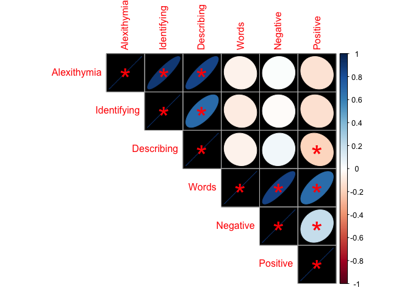

For Slides
================

``` r
knitr::opts_chunk$set(echo = TRUE, message = FALSE)
library(corrplot)
library(tidyverse)
library(lme4)
library(sjPlot)

transperent <-   theme(panel.background = element_rect(fill = "transparent"),
        plot.background = element_rect(fill = "transparent", color = NA),
        legend.background = element_rect(fill = "transparent"), # get rid of legend bg
        legend.box.background = element_rect(fill = "transparent"),
        axis.line = element_line(color = "White"),
        axis.text = element_text(color = "White"),
        axis.title = element_text(color = "White"))

cordat <- read_csv("AMAP Variables Computed.csv")
modeldat <- read_csv("LongJoinedMusicAffect.csv") 

cordat <- cordat %>% 
  dplyr::rename(Alexithymia = TAS,
                Identifying = DIF,
                Describing = DDF, 
                External = EOT,
                Words = Emo,
                Negative = NegEmo,
                Positive = PosEmo) %>% 
  dplyr::select(Alexithymia, 
                Identifying, 
                Describing, 
                Words, 
                Negative, 
                Positive)

corrplot::corrplot(corr = cor(cordat),
                         method = "ellipse",
                         bg = "Black",
                         type = "upper",
                         sig.level = c(.05),
                         pch.col = c("red"),
                         p.mat = cor.mtest(cordat)$p,
                         insig = c("label_sig"))    
```

<!-- -->

``` r
valenceplot <- sjPlot::plot_model(model = lme4::lmer(Valence~TAS*Target + (1|id), data = modeldat), 
                   type = "int",
                   title = "",
                   axis.title = c("Alexithymia Score", "Rated Valence"),
                   legend.title = "Target Emotion") + 
  ggplot2::theme_classic() +
  ggplot2::scale_y_continuous(name = "Rated Valence", breaks = c(-3, -2, -1, 0, 1, 2, 3), limits = c(-3,3)) +
  ggplot2::geom_hline(yintercept = 0, linetype = "dotted", color = "white") +
  transperent

  

ggsave(filename = "valence.png",
       plot = valenceplot, 
       bg = "transparent")


arousalplot <- sjPlot::plot_model(model = lme4::lmer(Arousal~TAS*Target + (1|id), data = modeldat), 
                   type = "int",
                   title = "",
                   axis.title = c("Alexithymia Score", "Rated Arousal"),
                   legend.title = "Target Emotion") + 
ggplot2::scale_y_continuous(name = "Rated Arousal", breaks = c(-3, -2, -1, 0, 1, 2, 3), limits = c(-3,3)) +
  ggplot2::theme_dark() +
  ggplot2::geom_hline(yintercept = 0, linetype = "dotted", color = "White") + 
  transperent   

ggsave(filename = "arousal.png",
       plot = arousalplot, 
       bg = "transparent")
```
