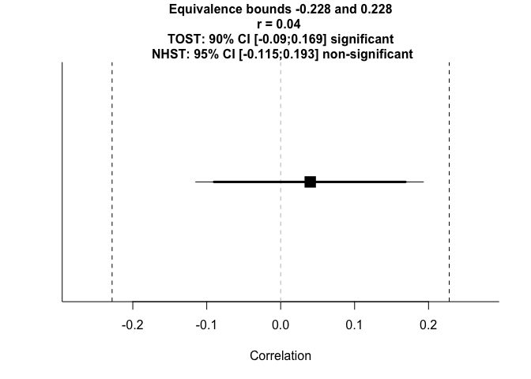
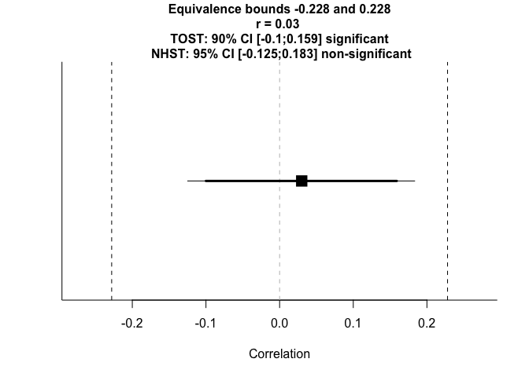
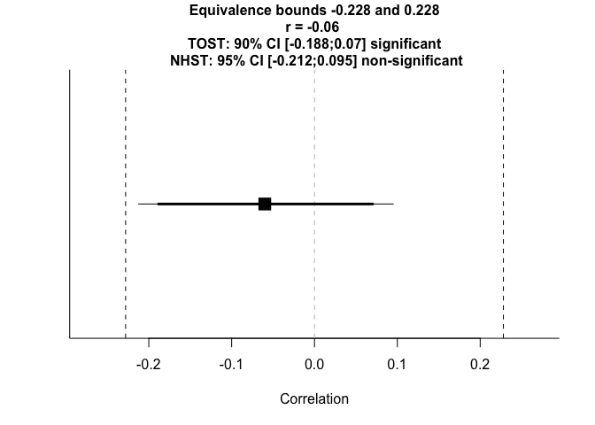
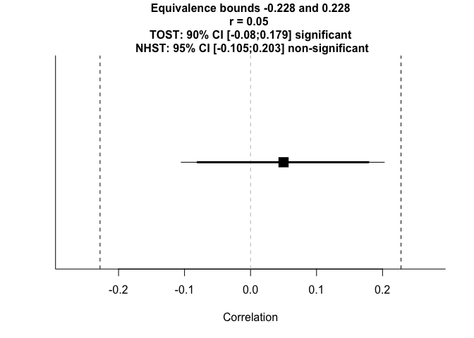
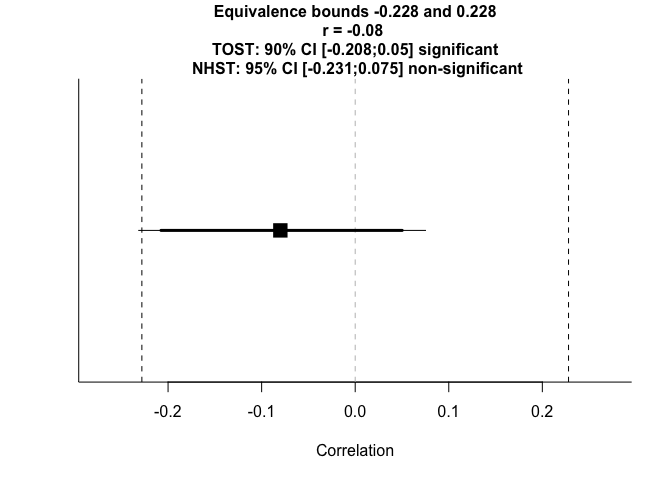
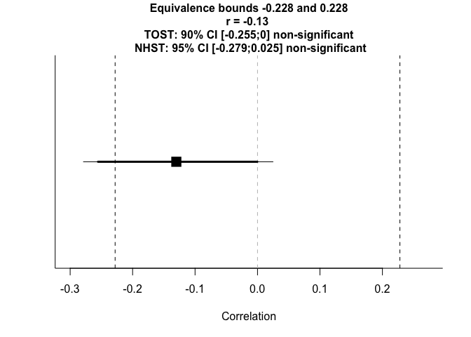
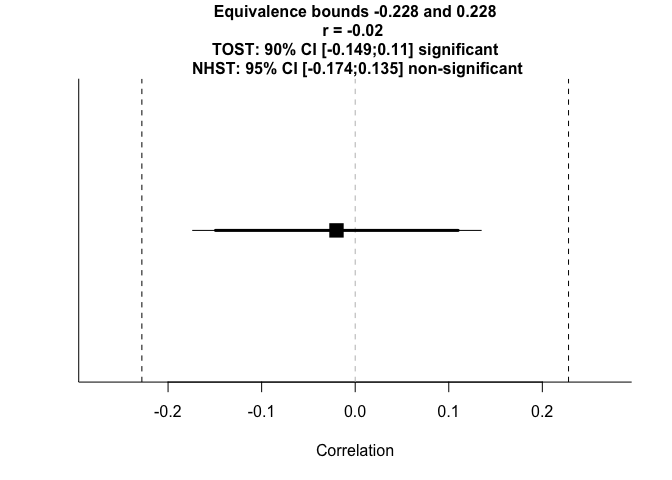

Supplementary Materials
================
Joel Larwood
10/06/2019

  - [Relationship between total alexithymia scores and total emotion
    words
    listed](#relationship-between-total-alexithymia-scores-and-total-emotion-words-listed)
  - [Relationship between total alexithymia scores and total positive
    emotion words
    listed](#relationship-between-total-alexithymia-scores-and-total-positive-emotion-words-listed)
  - [Relationship between total alexithymia scores and total negative
    emotion words
    listed](#relationship-between-total-alexithymia-scores-and-total-negative-emotion-words-listed)
  - [Relationship between Externally Oriented Thinking (EOT) and total
    emotion words
    listed](#relationship-between-externally-oriented-thinking-eot-and-total-emotion-words-listed)
  - [Relationship between Externally Oriented Thinking (EOT) and total
    positive emotion words
    listed](#relationship-between-externally-oriented-thinking-eot-and-total-positive-emotion-words-listed)
  - [Relationship between Externally Oriented Thinking (EOT) and total
    negative emotion words
    listed](#relationship-between-externally-oriented-thinking-eot-and-total-negative-emotion-words-listed)
  - [Relationship between Difficulty Describing Feelings (DDF) and total
    emotion words
    listed](#relationship-between-difficulty-describing-feelings-ddf-and-total-emotion-words-listed)
  - [Relationship between Difficulty Describing Feelings (DDF) and total
    negative emotion words
    listed](#relationship-between-difficulty-describing-feelings-ddf-and-total-negative-emotion-words-listed)
  - [Relationship between Difficulty Identifying Feelings (DDF) and
    total emotion words
    listed](#relationship-between-difficulty-identifying-feelings-ddf-and-total-emotion-words-listed)
  - [Relationship between Difficulty Identifying Feelings (DDF) and
    total positive emotion words
    listed](#relationship-between-difficulty-identifying-feelings-ddf-and-total-positive-emotion-words-listed)
  - [Relationship between Difficulty Identifying Feelings (DDF) and
    total negative emotion words
    listed](#relationship-between-difficulty-identifying-feelings-ddf-and-total-negative-emotion-words-listed)

``` r
library(TOSTER)
```

Here we present the Two One Sided Tests for the non-significant
correlations reported between alexithymia and recall emotion lexicon.
The interested reader may refer to Lakens, Scheel, and Isager (2018) for
the details of this method.

``` r
TOSTER::powerTOSTr(alpha = .05, statistical_power = .8, N = 162) 
```

    ## The equivalence bounds to achieve 80 % power with N = 162 are -0.23 and 0.23 .

    ## 

    ## [1] -0.2280002  0.2280002

``` r
low <- -.2280002
high <- 0.2280002
```

#### Relationship between total alexithymia scores and total emotion words listed

``` r
#total emotions
TOSTER::TOSTr(n = 162, r = -.05, low_eqbound_r = low, high_eqbound_r = high) 
```

    ## TOST results:
    ## p-value lower bound: 0.011
    ## p-value upper bound: 0.0002
    ## 
    ## Equivalence bounds (r):
    ## low eqbound: -0.228 
    ## high eqbound: 0.228
    ## 
    ## TOST confidence interval:
    ## lower bound 90% CI: -0.179
    ## upper bound 90% CI:  0.08
    ## 
    ## NHST confidence interval:
    ## lower bound 95% CI: -0.203
    ## upper bound 95% CI:  0.105
    ## 
    ## Equivalence Test Result:
    ## The equivalence test was significant, p = 0.0109, given equivalence bounds of -0.228 and 0.228 and an alpha of 0.05.

    ## 

    ## 
    ## Null Hypothesis Test Result:
    ## The null hypothesis test was non-significant, p = 0.527, given an alpha of 0.05.

    ## 

    ## 
    ## Based on the equivalence test and the null-hypothesis test combined, we can conclude that the observed effect is statistically not different from zero and statistically equivalent to zero.

    ## 

<!-- -->

#### Relationship between total alexithymia scores and total positive emotion words listed

``` r
#positive emotions  
TOSTER::TOSTr(n = 162, r = -.13, low_eqbound_r = low, high_eqbound_r = high) 
```

    ## TOST results:
    ## p-value lower bound: 0.101
    ## p-value upper bound: 0.000002
    ## 
    ## Equivalence bounds (r):
    ## low eqbound: -0.228 
    ## high eqbound: 0.228
    ## 
    ## TOST confidence interval:
    ## lower bound 90% CI: -0.255
    ## upper bound 90% CI:  0
    ## 
    ## NHST confidence interval:
    ## lower bound 95% CI: -0.279
    ## upper bound 95% CI:  0.025
    ## 
    ## Equivalence Test Result:
    ## The equivalence test was non-significant, p = 0.101, given equivalence bounds of -0.228 and 0.228 and an alpha of 0.05.

    ## 

    ## 
    ## Null Hypothesis Test Result:
    ## The null hypothesis test was non-significant, p = 0.0992, given an alpha of 0.05.

    ## 

    ## 
    ## Based on the equivalence test and the null-hypothesis test combined, we can conclude that the observed effect is statistically not different from zero and statistically not equivalent to zero.

    ## 

<!-- -->

#### Relationship between total alexithymia scores and total negative emotion words listed

``` r
#negative emotions
TOSTER::TOSTr(n = 162, r = .02, low_eqbound_r = low, high_eqbound_r = high)  
```

    ## TOST results:
    ## p-value lower bound: 0.0007
    ## p-value upper bound: 0.004
    ## 
    ## Equivalence bounds (r):
    ## low eqbound: -0.228 
    ## high eqbound: 0.228
    ## 
    ## TOST confidence interval:
    ## lower bound 90% CI: -0.11
    ## upper bound 90% CI:  0.149
    ## 
    ## NHST confidence interval:
    ## lower bound 95% CI: -0.135
    ## upper bound 95% CI:  0.174
    ## 
    ## Equivalence Test Result:
    ## The equivalence test was significant, p = 0.00375, given equivalence bounds of -0.228 and 0.228 and an alpha of 0.05.

    ## 

    ## 
    ## Null Hypothesis Test Result:
    ## The null hypothesis test was non-significant, p = 0.801, given an alpha of 0.05.

    ## 

    ## 
    ## Based on the equivalence test and the null-hypothesis test combined, we can conclude that the observed effect is statistically not different from zero and statistically equivalent to zero.

    ## 

<!-- -->

#### Relationship between Externally Oriented Thinking (EOT) and total emotion words listed

``` r
TOSTER::TOSTr(n = 162, r = .04, low_eqbound_r = low, high_eqbound_r = high)  
```

    ## TOST results:
    ## p-value lower bound: 0.0003
    ## p-value upper bound: 0.008
    ## 
    ## Equivalence bounds (r):
    ## low eqbound: -0.228 
    ## high eqbound: 0.228
    ## 
    ## TOST confidence interval:
    ## lower bound 90% CI: -0.09
    ## upper bound 90% CI:  0.169
    ## 
    ## NHST confidence interval:
    ## lower bound 95% CI: -0.115
    ## upper bound 95% CI:  0.193
    ## 
    ## Equivalence Test Result:
    ## The equivalence test was significant, p = 0.00772, given equivalence bounds of -0.228 and 0.228 and an alpha of 0.05.

    ## 

    ## 
    ## Null Hypothesis Test Result:
    ## The null hypothesis test was non-significant, p = 0.613, given an alpha of 0.05.

    ## 

    ## 
    ## Based on the equivalence test and the null-hypothesis test combined, we can conclude that the observed effect is statistically not different from zero and statistically equivalent to zero.

    ## 

<!-- -->

#### Relationship between Externally Oriented Thinking (EOT) and total positive emotion words listed

``` r
TOSTER::TOSTr(n = 162, r = .03, low_eqbound_r = low, high_eqbound_r = high)  
```

    ## TOST results:
    ## p-value lower bound: 0.0005
    ## p-value upper bound: 0.005
    ## 
    ## Equivalence bounds (r):
    ## low eqbound: -0.228 
    ## high eqbound: 0.228
    ## 
    ## TOST confidence interval:
    ## lower bound 90% CI: -0.1
    ## upper bound 90% CI:  0.159
    ## 
    ## NHST confidence interval:
    ## lower bound 95% CI: -0.125
    ## upper bound 95% CI:  0.183
    ## 
    ## Equivalence Test Result:
    ## The equivalence test was significant, p = 0.00542, given equivalence bounds of -0.228 and 0.228 and an alpha of 0.05.

    ## 

    ## 
    ## Null Hypothesis Test Result:
    ## The null hypothesis test was non-significant, p = 0.705, given an alpha of 0.05.

    ## 

    ## 
    ## Based on the equivalence test and the null-hypothesis test combined, we can conclude that the observed effect is statistically not different from zero and statistically equivalent to zero.

    ## 

<!-- -->

#### Relationship between Externally Oriented Thinking (EOT) and total negative emotion words listed

``` r
TOSTER::TOSTr(n = 162, r = .03, low_eqbound_r = low, high_eqbound_r = high)  
```

    ## TOST results:
    ## p-value lower bound: 0.0005
    ## p-value upper bound: 0.005
    ## 
    ## Equivalence bounds (r):
    ## low eqbound: -0.228 
    ## high eqbound: 0.228
    ## 
    ## TOST confidence interval:
    ## lower bound 90% CI: -0.1
    ## upper bound 90% CI:  0.159
    ## 
    ## NHST confidence interval:
    ## lower bound 95% CI: -0.125
    ## upper bound 95% CI:  0.183
    ## 
    ## Equivalence Test Result:
    ## The equivalence test was significant, p = 0.00542, given equivalence bounds of -0.228 and 0.228 and an alpha of 0.05.

    ## 

    ## 
    ## Null Hypothesis Test Result:
    ## The null hypothesis test was non-significant, p = 0.705, given an alpha of 0.05.

    ## 

    ## 
    ## Based on the equivalence test and the null-hypothesis test combined, we can conclude that the observed effect is statistically not different from zero and statistically equivalent to zero.

    ## 

<!-- -->

#### Relationship between Difficulty Describing Feelings (DDF) and total emotion words listed

``` r
TOSTER::TOSTr(n = 162, r = -.06, low_eqbound_r = low, high_eqbound_r = high)  
```

    ## TOST results:
    ## p-value lower bound: 0.015
    ## p-value upper bound: 0.0001
    ## 
    ## Equivalence bounds (r):
    ## low eqbound: -0.228 
    ## high eqbound: 0.228
    ## 
    ## TOST confidence interval:
    ## lower bound 90% CI: -0.188
    ## upper bound 90% CI:  0.07
    ## 
    ## NHST confidence interval:
    ## lower bound 95% CI: -0.212
    ## upper bound 95% CI:  0.095
    ## 
    ## Equivalence Test Result:
    ## The equivalence test was significant, p = 0.015, given equivalence bounds of -0.228 and 0.228 and an alpha of 0.05.

    ## 

    ## 
    ## Null Hypothesis Test Result:
    ## The null hypothesis test was non-significant, p = 0.448, given an alpha of 0.05.

    ## 

    ## 
    ## Based on the equivalence test and the null-hypothesis test combined, we can conclude that the observed effect is statistically not different from zero and statistically equivalent to zero.

    ## 

<!-- -->

#### Relationship between Difficulty Describing Feelings (DDF) and total negative emotion words listed

``` r
TOSTER::TOSTr(n = 162, r = .05, low_eqbound_r = low, high_eqbound_r = high)  
```

    ## TOST results:
    ## p-value lower bound: 0.0002
    ## p-value upper bound: 0.011
    ## 
    ## Equivalence bounds (r):
    ## low eqbound: -0.228 
    ## high eqbound: 0.228
    ## 
    ## TOST confidence interval:
    ## lower bound 90% CI: -0.08
    ## upper bound 90% CI:  0.179
    ## 
    ## NHST confidence interval:
    ## lower bound 95% CI: -0.105
    ## upper bound 95% CI:  0.203
    ## 
    ## Equivalence Test Result:
    ## The equivalence test was significant, p = 0.0109, given equivalence bounds of -0.228 and 0.228 and an alpha of 0.05.

    ## 

    ## 
    ## Null Hypothesis Test Result:
    ## The null hypothesis test was non-significant, p = 0.527, given an alpha of 0.05.

    ## 

    ## 
    ## Based on the equivalence test and the null-hypothesis test combined, we can conclude that the observed effect is statistically not different from zero and statistically equivalent to zero.

    ## 

<!-- -->

#### Relationship between Difficulty Identifying Feelings (DDF) and total emotion words listed

``` r
TOSTER::TOSTr(n = 162, r = -.08, low_eqbound_r = low, high_eqbound_r = high)  
```

    ## TOST results:
    ## p-value lower bound: 0.028
    ## p-value upper bound: 0.00004
    ## 
    ## Equivalence bounds (r):
    ## low eqbound: -0.228 
    ## high eqbound: 0.228
    ## 
    ## TOST confidence interval:
    ## lower bound 90% CI: -0.208
    ## upper bound 90% CI:  0.05
    ## 
    ## NHST confidence interval:
    ## lower bound 95% CI: -0.231
    ## upper bound 95% CI:  0.075
    ## 
    ## Equivalence Test Result:
    ## The equivalence test was significant, p = 0.0277, given equivalence bounds of -0.228 and 0.228 and an alpha of 0.05.

    ## 

    ## 
    ## Null Hypothesis Test Result:
    ## The null hypothesis test was non-significant, p = 0.312, given an alpha of 0.05.

    ## 

    ## 
    ## Based on the equivalence test and the null-hypothesis test combined, we can conclude that the observed effect is statistically not different from zero and statistically equivalent to zero.

    ## 

<!-- -->

#### Relationship between Difficulty Identifying Feelings (DDF) and total positive emotion words listed

``` r
TOSTER::TOSTr(n = 162, r = -.13, low_eqbound_r = low, high_eqbound_r = high)  
```

    ## TOST results:
    ## p-value lower bound: 0.101
    ## p-value upper bound: 0.000002
    ## 
    ## Equivalence bounds (r):
    ## low eqbound: -0.228 
    ## high eqbound: 0.228
    ## 
    ## TOST confidence interval:
    ## lower bound 90% CI: -0.255
    ## upper bound 90% CI:  0
    ## 
    ## NHST confidence interval:
    ## lower bound 95% CI: -0.279
    ## upper bound 95% CI:  0.025
    ## 
    ## Equivalence Test Result:
    ## The equivalence test was non-significant, p = 0.101, given equivalence bounds of -0.228 and 0.228 and an alpha of 0.05.

    ## 

    ## 
    ## Null Hypothesis Test Result:
    ## The null hypothesis test was non-significant, p = 0.0992, given an alpha of 0.05.

    ## 

    ## 
    ## Based on the equivalence test and the null-hypothesis test combined, we can conclude that the observed effect is statistically not different from zero and statistically not equivalent to zero.

    ## 

<!-- -->

#### Relationship between Difficulty Identifying Feelings (DDF) and total negative emotion words listed

``` r
TOSTER::TOSTr(n = 162, r = -.02, low_eqbound_r = low, high_eqbound_r = high)  
```

    ## TOST results:
    ## p-value lower bound: 0.004
    ## p-value upper bound: 0.0007
    ## 
    ## Equivalence bounds (r):
    ## low eqbound: -0.228 
    ## high eqbound: 0.228
    ## 
    ## TOST confidence interval:
    ## lower bound 90% CI: -0.149
    ## upper bound 90% CI:  0.11
    ## 
    ## NHST confidence interval:
    ## lower bound 95% CI: -0.174
    ## upper bound 95% CI:  0.135
    ## 
    ## Equivalence Test Result:
    ## The equivalence test was significant, p = 0.00375, given equivalence bounds of -0.228 and 0.228 and an alpha of 0.05.

    ## 

    ## 
    ## Null Hypothesis Test Result:
    ## The null hypothesis test was non-significant, p = 0.801, given an alpha of 0.05.

    ## 

    ## 
    ## Based on the equivalence test and the null-hypothesis test combined, we can conclude that the observed effect is statistically not different from zero and statistically equivalent to zero.

    ## 

<!-- -->
